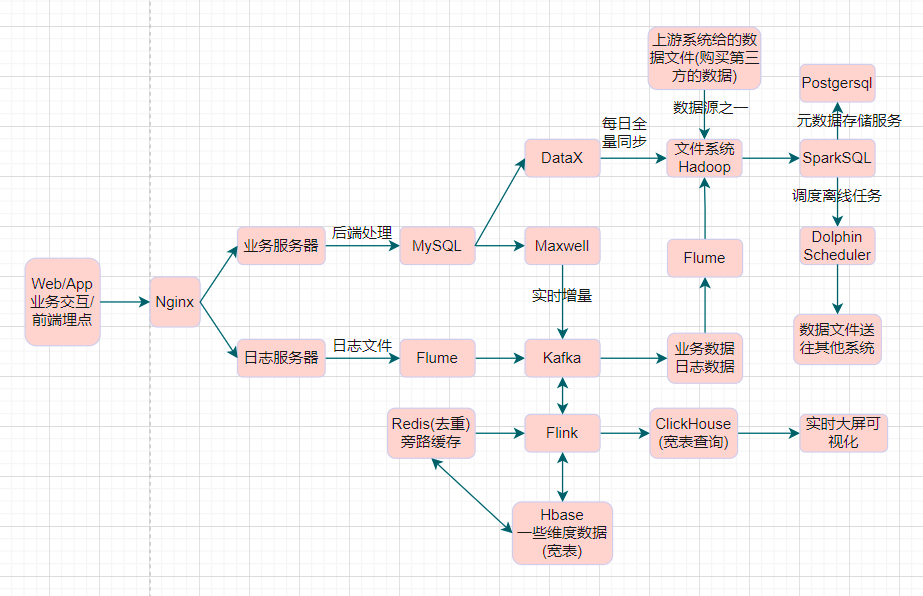
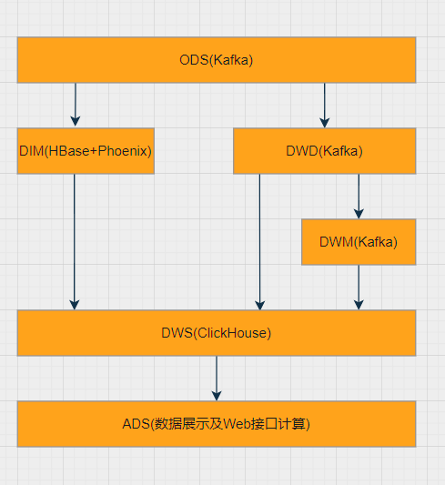

[TOC]

# 项目架构



实时核心：Flink

离线核心：Spark

```properties
实时数仓分层:
	计算框架:Flink;存储框架:消息队列(可以实时读取&可以实时写入)
	ODS:Kafka
		使用场景:每过来一条数据,读取到并加工处理
	DIM:HBase
		使用场景:事实表会根据主键获取一行维表数据(1.永久存储、2.根据主键查询)	   
		Kafka:不能长期存储，有一些比较重要的用户信息需要长期存储的做不到,并且不提供根据主键的查询     ×
		HBase:海量数据永久存储,根据主键快速查询          √
		Redis:用户表数据量大,内存数据库                 ×
		ClickHouse:并发不行,列存                       ×
		ES:默认给所有字段创建索引                       ×
		Hive(HDFS):效率低下                            ×
		Mysql本身:压力太大,实在要用就使用从库            √
	DWD:Kafka
		使用场景:每过来一条数据,读取到并分组累加处理
	DWS:ClickHouse
		使用场景:每过来一条数据,读取到并重新分组、累加处理
	ADS:不落盘,实质上是接口模块中查询ClickHouse的SQL语句
		使用场景:读取最终结果数据展示
```

# 集群配置

| 组件             | 版本      | Flink01(6G+60GB) | Flink02(4G+60GB) | Flink02(4G+60GB) |
| ---------------- | --------- | ---------------- | ---------------- | ---------------- |
| Hadoop           | 3.1.3     | √                | √                | √                |
| Zookeeper        | 3.5.7     | √                | √                | √                |
| Kafka            | 3.0.0     | √                | √                | √                |
| Flume            | 1.9.0     | √(日志服务器)    | √(日志服务器)    | √(业务服务器)    |
| Maxwell          | 1.29.2    | √                |                  |                  |
| DataX            | 3.0       |                  | √                |                  |
| MySQL            | 8.0       |                  | √                |                  |
| SparkSQL         | 3.3.1     | √                | √                | √                |
| Hbase            | 2.3.5     | √                | √                | √                |
| Flink            | 1.13.1    | √                | √                | √                |
| Clickhouse       | 20.4.5.36 |                  | √                |                  |
| Redis            | 7.0.0     | √                |                  |                  |
| DolphinScheduler | 2.0.7     | √                | √                | √                |

# 开发工具

| 工具                            | 版本     | 用途                               |
| ------------------------------- | -------- | ---------------------------------- |
| IntelliJ IDEA(Ultimate Edition) | 2022.2.3 | 项目代码编写管理                   |
| OffsetExplorer                  | 2.3      | Kafka windows 可视化               |
| DBeaver Enterprise              | 21.3.0   | 数据库可视化, 支持Redis, MongoDB等 |
| VMware 16 Pro                   | 16.1.0   | 创建虚拟机服务器                   |
| MobaXterm                       | 22.1     | 虚拟机可视化终端                   |

# 数仓分层




| 分层 | 数据流                                                       | 工具                               | 存储介质     |
| ---- | ------------------------------------------------------------ | ---------------------------------- | ------------ |
| ODS  | 原始数据，日志和业务数据                                     | 日志服务器，FlinkCDC/Maxwell/Canal | Kafka        |
| DWD  | 根据数据对象为单位进行分流，比如订单、页面访问等等。         | Flink                              | Kafka        |
| DWM  | 对于部分数据对象进行进一步加工，比如独立访问、跳出行为。依旧是明细数据。 | Flink                              | Kafka        |
| DIM  | 维度数据                                                     | Flink                              | HBase        |
| DWS  | 根据某个维度主题将多个事实数据轻度聚合，形成宽表             | Flink                              | Clickhouse   |
| ADS  | 把 Clickhouse 中的数据根据可视化需要进行筛选聚合             | ClickhouseSQL                      | 可视化BI工具 |

# 集群脚本

| 脚本名                              | 功能                                                |
| ----------------------------------- | --------------------------------------------------- |
| xcall.sh(Flink01)                   | 查看集群进程                                        |
| xsync(Flink01)                      | 集群文件分发                                        |
| hdp.sh(Flink01)                     | 启动Hadoop和Yarn                                    |
| zk.sh(Flink01)                      | 启动Zookeeper                                       |
| kfk.sh(Flink01)                     | 启动Kafka                                           |
| mxw.sh(Flink01)                     | 启动Maxwell                                         |
| app_log.sh(Flink01)                 | 模拟用户行为日志                                    |
| db_log.sh(Flink01)                  | 模拟业务交互日志                                    |
| flume_applog_kafka.sh(Flink01)      | flume采集用户行为日志到kafka                        |
| flume_dblog_hdfs.sh(Flink01)        | flume消费kafka业务日志到hdfs                        |
| flume_applog_hdfs.sh(Flink01)       | flume消费kafka用户行为日志到hdfs                    |
| gen_import_config.py(Flink02)       | 生成datax抽数配置文件                               |
| gen_import_config.sh(Flink02)       | 批量生成对应表的datax抽数配置文件                   |
| mysql_to_hdfs_full.sh(Flink02)      | 将mysql的全量业务表的数据批量导入到hdfs             |
| mysql_to_kafka_inc_init.sh(Flink01) | 将mysql的增量业务数据初始化一次，也就是全量导入一次 |
| sparksql.sh(Flink01)                | 启动sparksql，用jdbc工具连接，可以进行离线分析      |
|                                     |                                                     |
