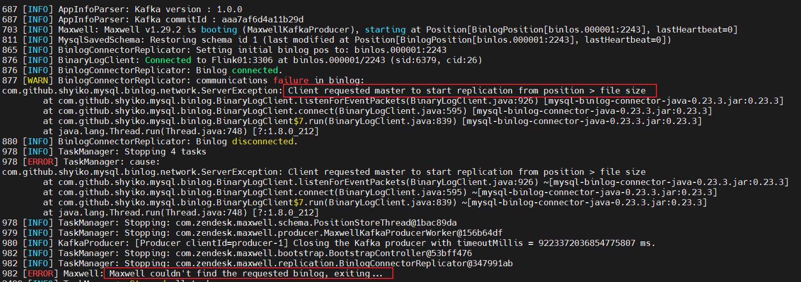
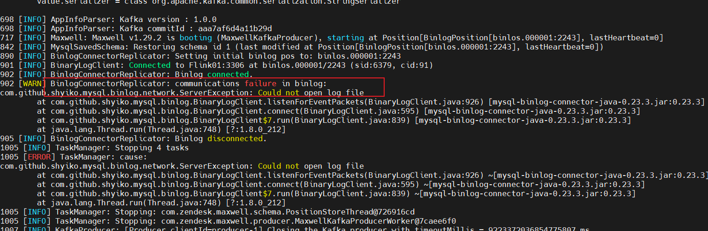
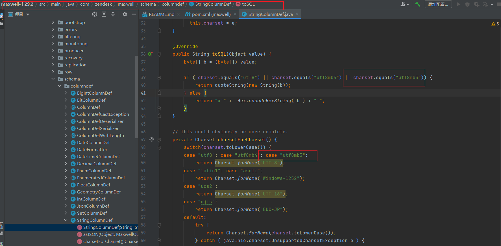
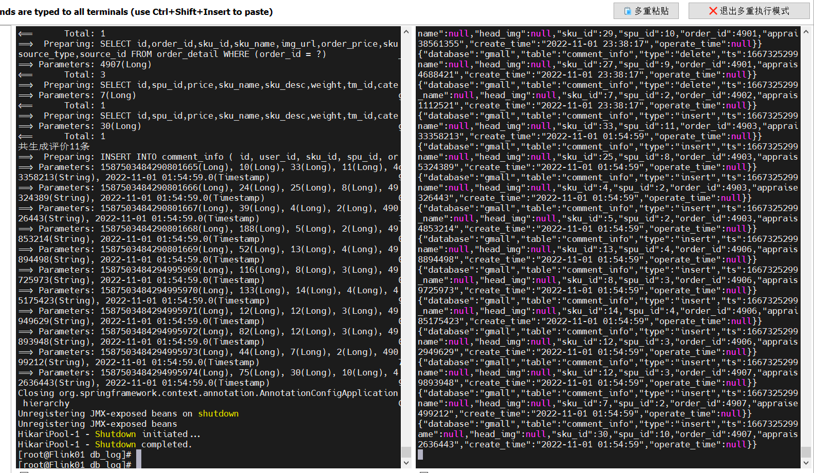
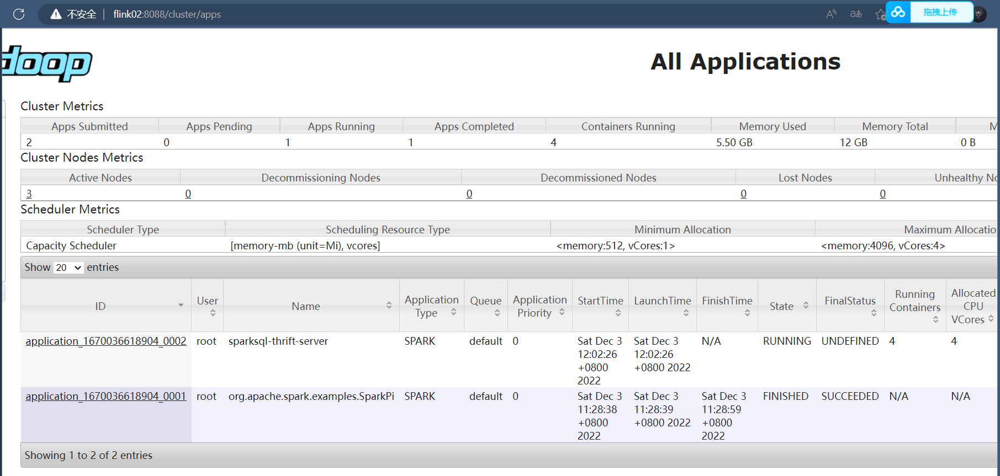
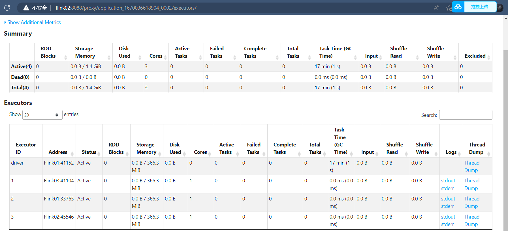
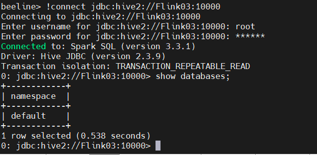
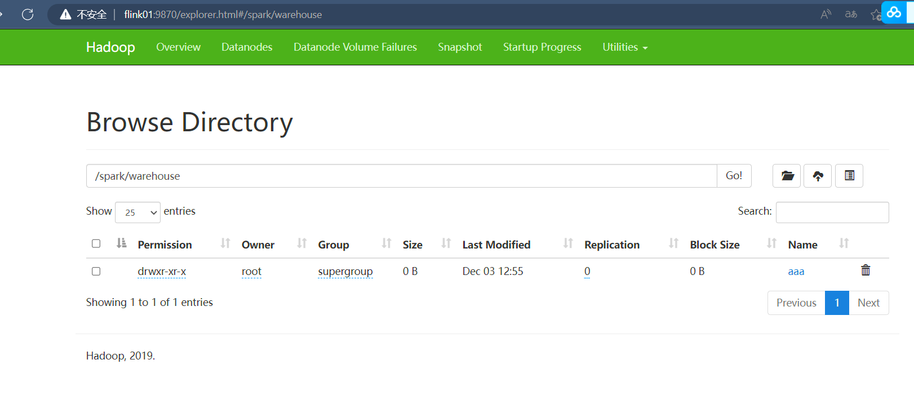
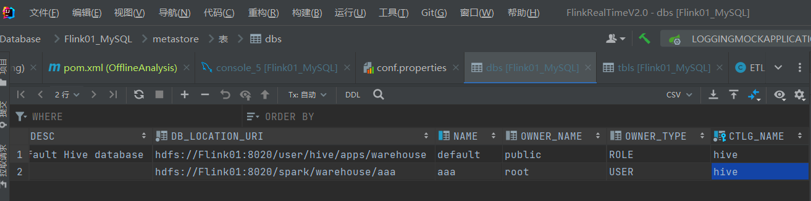

## 项目集群搭建部署注意事项

[TOC]


### 1.项目集群启动脚本：

```shell
#集群分发脚本
xsync
#启动Hadoop(yarn)
hdp.sh start/stop
#启动zookeeper
zk.sh start/stop/status
#启动kafka
kfk.sh start/stop
#启动kafka-eagle(kafka可视化)
ke.sh start/stop
#启动Hbase
start-hbase.sh start/stop
#启动Flink
start-cluster.sh
#mysql
service mysql start/status(默认是开机自启的)

集群启动脚本：
cluster.sh start/stop

#模拟用户行为日志数据生成脚本
lg.sh 
#flume采集用户行为日志脚本(实时链路)
f1.sh start/stop
#flume采集用户行为日志脚本(离线链路)
f2.sh start/stop
#datax全量表数据同步脚本(离线全量同步)
mysql_to_hdfs_full.sh
#Maxwell增量表首日全量同步(实时增量同步之前先做一次全量同步，只需要做一次)
mysql_to_kafka_inc_init.sh
```

### 2.MySQL

#### 2.1mysql安装注意事项(安装好mysql以后)：

```sql
1.初始化MySQL8.0
去到bin目录下
mysqld --initialize --user=mysql --basedir=/opt/module/mysql8.0/ --datadir=/opt/module/mysql8.0/data/ --pid-file=/opt/module/mysql8.0/data/mysql.pid
2：修改初始化密码
ALTER USER 'root'@'localhost' IDENTIFIED WITH mysql_native_password BY 'password';   password为你要修改之后的密码
3：刷新权限
flush privileges;
4：修改 host
use mysql;
update user set host='%' where user='root';
5:允许远程连接
赋权限 all 表示所有权限（select,update等） %表示允许所有地址 也可以是具体的ip地址
grant all privileges on *.* to 'root'@'%' with grant option;
6：mysql开机自启
cp /usr/local/mysql/support-files/mysql.server /etc/init.d/mysql
7:赋予可执行权限
chmod +x /etc/init.d/mysql
8:添加服务
chkconfig --add mysql
9:开关mysql服务
service mysql start  ##开启服务
service mysql stop   ##关闭服务
```

#### 2.2MySQL的binlog常用命令

```sql
#查看日志开启状态 
show global variables like "log_bin%";
#查看所有binlog日志列表
show master logs;
#查看最新一个binlog日志的编号名称，及其最后一个操作事件结束点 
show master status;
#查看binlog的其他配置
show global variables like "binlog%";
#刷新log日志，立刻产生一个新编号的binlog日志文件，跟重启一个效果 
flush logs;
#清空所有binlog日志 
reset master;
```

#### 2.3mysql创建Maxwell用户并赋予权限

```sql
#MySQL8.0:
CREATE USER 'maxwell'@'%' IDENTIFIED with 'mysql_native_password' BY 'maxwell';
grant all privileges on maxwell.* to 'maxwell'@'%' ;
GRANT SELECT ,REPLICATION SLAVE , REPLICATION CLIENT ON 
*.* TO maxwell@'%';

#MySQL 5.7:
CREATE DATABASE maxwell;
CREATE USER 'maxwell'@'%' IDENTIFIED BY 'maxwell';
GRANT ALL ON maxwell.* TO 'maxwell'@'%';
GRANT SELECT, REPLICATION CLIENT, REPLICATION SLAVE ON *.* TO 'maxwell'@'%';
```

### 3.Maxwell

#### 3.1测试maxwell同步MySQL binlog时报错

如果出现以下报错

1.Maxwell读取的binlog的位置跟mysql中的位置不一样，长时间没用Maxwell，突然开启会导致



解决办法：

1.先查看MySQL的最新的binlog的日志编号和操作事件的结束点是否和Maxwell里的对应得上(使用第五点给出的sql语句可以查出来)：

上图看出，MySQL最新得binlog日志编号是000001，事件结束点是157


再去maxwell的元数据库里的表positions看到位置是157(这是我后面改的,之前是不一样的)

2.出现以下报错是因为mysql的binlog文件不存在或者是文件所在的目录不是mysql:mysql用户和属组

可是使用上面第五点给出的sql查出binlog对应的位置



4.2在实时增量同步MySQL数据到kafka时报错

**maxwell 报错: java.lang.RuntimeException: error: unhandled character set ‘utf8mb3‘**

这个问题是因为MySQL从 5.5.3 开始，用 utf8mb4 编码来实现完整的 UTF-8，其中 mb4 表示 most bytes 4，最多占用4个字节。而原来的utf8则被utf8mb3则代替。

一种解决方案是，将MySQL降级，重新安装5.5.3以下的版本。

另一种方法则是修改maxwell源码。

首先在github上下载maxwell对应版本的源码。链接：https://github.com/zendesk/maxwell

解压打开，找到有问题的类：com.zendesk.maxwell.schema.columndef.StringColumnDef，加上能识别utf8mb3的语句。



编译好以后上传到集群上即可

### 4.Kafka

#### 4.1主题命令行操作参数

**/opt/module/kafka/bin/kafka-topics.sh**

```shell
#连接的Kafka Broker主机名称和端口号(必带)
--bootstrap-server <String: server toconnect to>
#操作的topic名称(必带)
--topic <String: topic>
#创建主题/删除主题/修改主题/查看所有主题/查看主题详细描述
--create/--delete/--alter/--list/--describe
```

#### 4.2开启kafka消费者

```shell
#开启消费者消费用户日志数据
/opt/module/kafka/bin/kafka-console-consumer.sh --bootstrap-server Flink01:9092 --topic topic_log
#开启消费者消费业务数据
/opt/module/kafka/bin/kafka-console-consumer.sh --bootstrap-server Flink01:9092 --topic topic_db
#消费所有数据
./bin/kafka-console-consumer.sh --bootstrap-server Flink01:9092 --topic topic_log --from-beginning(从头消费)
```

#### 4.3实时增量同步

保证zookeeper和kafka还有MySQL及Maxwell正常运行着，然后开启模拟业务数据和用户日志数据的脚本，开两个kafka消费者的窗口，消费两个主题，观察是否可以消费到对应的数据



#### 4.4全量同步历史数据

为了保证得到一个完整的数据集，一般只有增量是不够的，所以在增量之前先进行一次历史数据的全量同步，这样可以保证得到一个完整的数据集

Maxwell提供了bootstrap功能进行历史数据全量同步：

```shell
/opt/module/maxwell/bin/maxwell-bootstrap --database gmall --table user_info --config /opt/module/maxwell/config.properties
```

bootstrap同步时数据格式：

```mathematica
{
    "database": "fooDB",
    "table": "barTable",
    "type": "bootstrap-start",##开始的标志，不包含数据
    "ts": 1450557744,
    "data": {}
}
{
    "database": "fooDB",
    "table": "barTable",
    "type": "bootstrap-insert",
    "ts": 1450557744,
    "data": {
        "txt": "hello"
    }
}
{
    "database": "fooDB",
    "table": "barTable",
    "type": "bootstrap-insert",
    "ts": 1450557744,##每次bootstrap的所有记录的ts都相同,都为开始的时间
    "data": {
        "txt": "bootstrap!"
    }
}
{
    "database": "fooDB",
    "table": "barTable",
    "type": "bootstrap-complete",##结束的标志，不包含数据
    "ts": 1450557744,
    "data": {}
}
```

### 5.Spark

这里我抛弃了hive，只用sparksql，只用了hive的metadata的服务，spark SQL也是跑在yarn上.

将hive-site.xml复制到spark/conf目录下

并且将spark的jar目录下的jar包全部上传到hdfs上，并在spark-default.env里已经配置好

**Spark-Thriftserver启动**

```shell
/opt/module/spark/sbin/start-thriftserver.sh \
--name sparksql-job \
--master yarn \
--deploy-mode client \
--driver-memory 1g \
--hiveconf hive.server2.thrift.http.port=10000 \
--num-executors 2 \
--executor-memory 1g \
--conf spark.sql.shuffle.partitions=2
```

启动之后，可以看到yarn的界面



包括启动参数里的executors数量，driver的话只有一个，在客户端上，因为启动模式就是client



启动完成之后，可以通过一些jdbc客户端连接，比如idea，dbeaver，beeline

```shell
/opt/module/bin/beeline
beeline> !connect jdbc:hive2://Flink03:10000
```

尝试建外表，指定hdfs路径



然后去hdfs上看



因为元数据配置的MySQL，可以去MySQL里看是否有对应的元数据


