[TOC]

# 数据同步(实时)

实时数据同步由Flink源源不断从Kafka当中读数据计算，也就是后续在各个层级的数据处理，都是实时的，所以不需要手动同步数据到实时数仓

# 数据同步(离线)

## 1 用户行为数据同步

### 1.1 数据管道

用户行为数据由Flume从Kafka直接同步到HDFS，由于离线数仓采用分区表按天统计，所以目标路径要包含一层日期

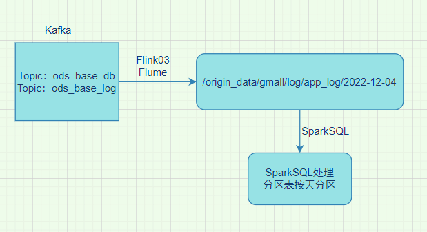

#### 1.1.1 用户日志数据同步管道配置

按照规划，该Flume需将Kafka中topic_log的数据发往HDFS。并且对每天产生的用户行为日志进行区分，将不同天的数据发往HDFS不同天的路径。

此处选择KafkaSource、FileChannel、HDFSSink。

关键配置如下：

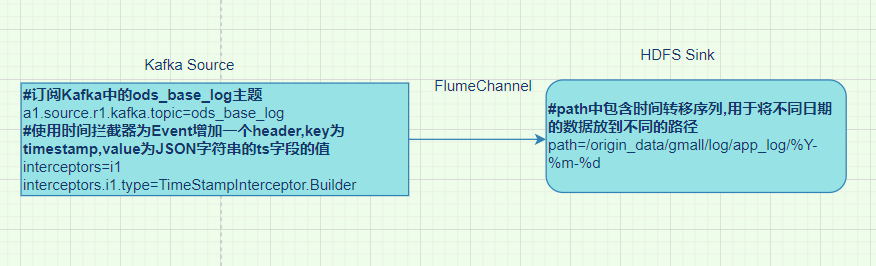

- 1 创建Flume配置文件

  在Flink03节点的Flume的job目录下创建kafka_to_hdfs_log.conf

  配置文件内容：

  ```shell
  #定义组件
  a1.sources=r1
  a1.channels=c1
  a1.sinks=k1
  #配置source1
  a1.sources.r1.type = org.apache.flume.source.kafka.KafkaSource
  a1.sources.r1.batchSize = 5000
  a1.sources.r1.batchDurationMillis = 2000
  a1.sources.r1.kafka.bootstrap.servers = hadoop102:9092,hadoop103:9092,hadoop104:9092
  a1.sources.r1.kafka.topics=topic_log
  a1.sources.r1.interceptors = i1
  a1.sources.r1.interceptors.i1.type = com.alex.flume.interceptor.TimestampInterceptor$Builder
  #配置channel
  a1.channels.c1.type = file
  a1.channels.c1.checkpointDir = /opt/module/flume/checkpoint/behavior1
  a1.channels.c1.dataDirs = /opt/module/flume/data/behavior1
  a1.channels.c1.maxFileSize = 2146435071
  a1.channels.c1.capacity = 1000000
  a1.channels.c1.keep-alive = 6
  #配置sink
  a1.sinks.k1.type = hdfs
  a1.sinks.k1.hdfs.path = /origin_data/gmall/log/app_log/%Y-%m-%d
  a1.sinks.k1.hdfs.filePrefix = log
  a1.sinks.k1.hdfs.round = false
  a1.sinks.k1.hdfs.rollInterval = 10
  a1.sinks.k1.hdfs.rollSize = 134217728
  a1.sinks.k1.hdfs.rollCount = 0
  #控制输出文件类型
  a1.sinks.k1.hdfs.fileType = CompressedStream
  a1.sinks.k1.hdfs.codeC = gzip
  #组装 
  a1.sources.r1.channels = c1
  a1.sinks.k1.channel = c1
  ```

  **配置优化**

  ```shell
  1）FileChannel优化
  通过配置dataDirs指向多个路径，每个路径对应不同的硬盘，增大Flume吞吐量。
  官方说明如下：
  Comma separated list of directories for storing log files. Using multiple directories on separate disks can improve file channel peformance
  checkpointDir和backupCheckpointDir也尽量配置在不同硬盘对应的目录中，保证checkpoint坏掉后，可以快速使用backupCheckpointDir恢复数据
  2）HDFS Sink优化
  （1）HDFS存入大量小文件，有什么影响？
  元数据层面：每个小文件都有一份元数据，其中包括文件路径，文件名，所有者，所属组，权限，创建时间等，这些信息都保存在Namenode内存中。所以小文件过多，会占用Namenode服务器大量内存，影响Namenode性能和使用寿命
  计算层面：默认情况下MR会对每个小文件启用一个Map任务计算，非常影响计算性能。同时也影响磁盘寻址时间。
  （2）HDFS小文件处理
  官方默认的这三个参数配置写入HDFS后会产生小文件，hdfs.rollInterval、hdfs.rollSize、hdfs.rollCount
  基于以上hdfs.rollInterval=3600，hdfs.rollSize=134217728，hdfs.rollCount =0几个参数综合作用，效果如下：
   1.文件在达到128M时会滚动生成新文件
   2.文件创建超3600秒时会滚动生成新文件
  ```

#### 测试结果

在zk，kfk，hdp都正常的前提下，先开启Flink01和Flink02的flume日志采集，再开启Flink03的日志消费，最后开启模拟日志程序

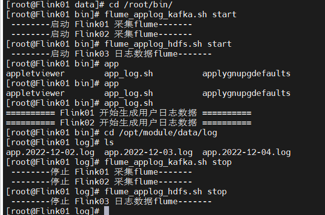

可以看到HDFS上有对应的数据生成

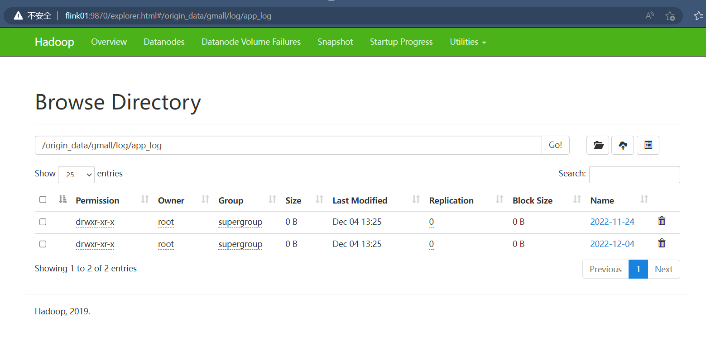

#### 1.1.2 数据漂移

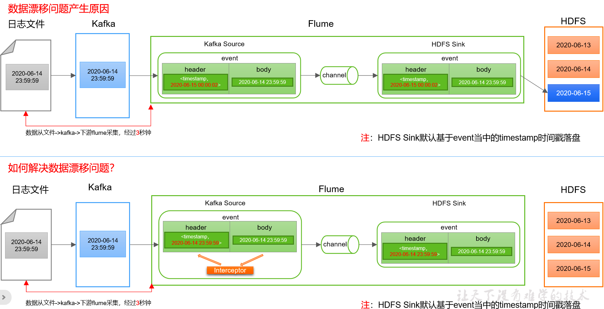

编写flume拦截器

在 package com.alex.flume.interceptor.TimestampInterceptor下

将代码打包成依赖包flume-interceptor-1.0-SNAPSHOT-jar-with-dependencies.jar上传到Flink03的/opt/module/flume/lib文件夹下面

## 2 业务数据同步

离线数仓的计算周期通常为天，所以数据同步周期也通常为天，即每天同步一次即可。

数据的同步策略有**全量同步**和**增量同步**。

需要同步的表分别有以下：

| 增量                  | 备注                 | 全量                | 备注           |
| --------------------- | :------------------- | ------------------- | -------------- |
| cart_info             | 加购表（特殊）       | activity_info       | 活动表         |
| order_info            | 订单表               | base_trademark      | 品牌表         |
| comment_info          | 商品评论表           | activity_rule       | 优惠规则表     |
| order_redund_info     | 退单表               | cart_info           | 加购表（特殊） |
| coupon_use            | 优惠卷领用表         | base_category1      | 商品一级分类   |
| order_status_log      | 订单状态表           | coupon_info         | 优惠券表       |
| favor_info            | 收藏表               | base_category2      | 商品二级分类   |
| payment_info          | 支付表               | sku_attr_value      | SKU平台属性表  |
| order_detail_activity | 订单明细活动关联表   | base_category3      | 商品三级分类   |
| refund_payment        | 退款表               | sku_sale_attr_value | SKU销售属性表  |
| order_detail_coupon   | 订单明细优惠券关联表 | base_dic            | 编码字典表     |
| user_info             | 用户表               | sku_info            | SKU商品表      |
| order_detail          | 订单详情表           | base_province       | 省份表         |
|                       |                      | spu_info            | SPU商品表      |
|                       |                      | base_region         | 地区表         |

本项目中，全量同步采用DataX，增量同步采用Maxwell

### 2.1 数据管道(全量)

全量表数据由DataX从MySQL业务数据库直接同步到HDFS

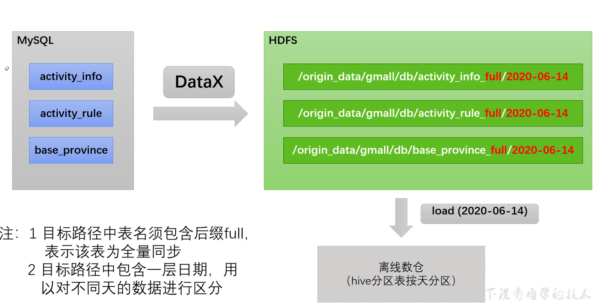

#### 2.1.1 业务数据全量同步管道配置

DataX配置文件，需要为每张全量表编写一个DataX的json配置文件

gen_import_config.py+gen_import_config.sh会批量生成全量表的DataX配置文件

全量表数据同步脚本：mysql_to_hdfs_full.sh

使用：

```shell
mysql_to_hdfs_full.sh all 2022-12-04
```

#### 测试结果

因为Datax在Flink02上，所以脚本也在Flink02上执行，保证mysql里有业务数据，如果没有的话用模拟器先生成一些，再去Flink02上使用脚本mysql_to_hdfs_full.sh all 2022-12-04将全量表的数据全部抽取到HDFS上(路径没创建的话会自动创建)

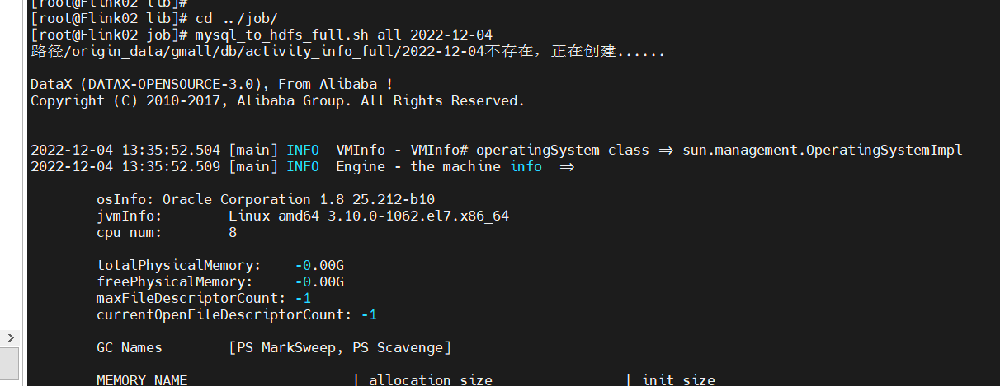

抽取完以后可以在HDFS上看到全量表的数据

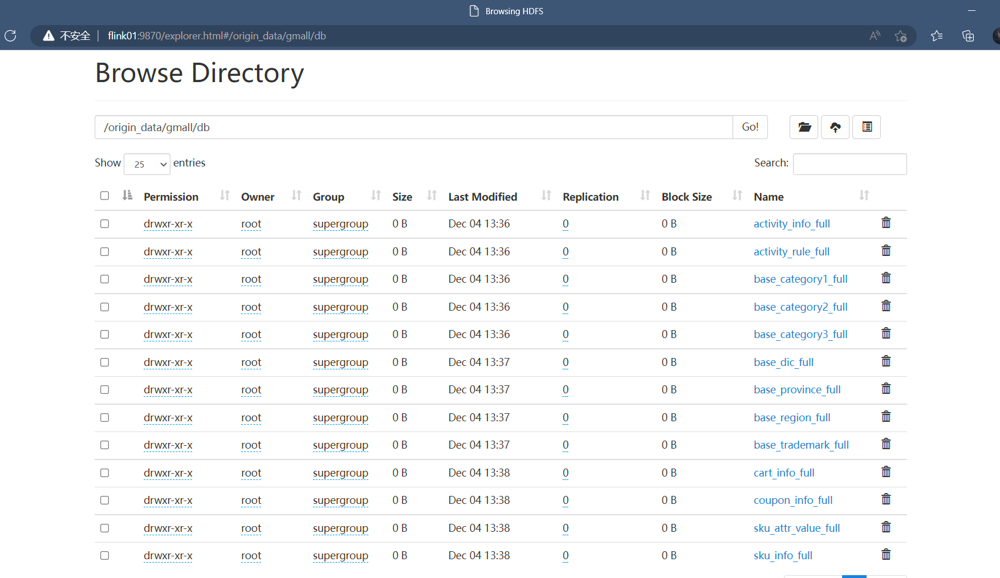

### 2.2 数据管道(增量)

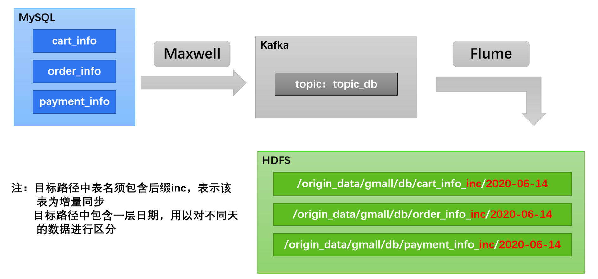

#### 2.2.1 业务数据增量同步管道配置

Flume需要将Kafka中topic_db主题的数据传输到HDFS，故其需选用KafkaSource以及HDFSSink，Channel选用FileChannel。

需要注意的是， HDFSSink需要将不同mysql业务表的数据写到不同的路径，并且路径中应当包含一层日期，用于区分每天的数据。关键配置如下：

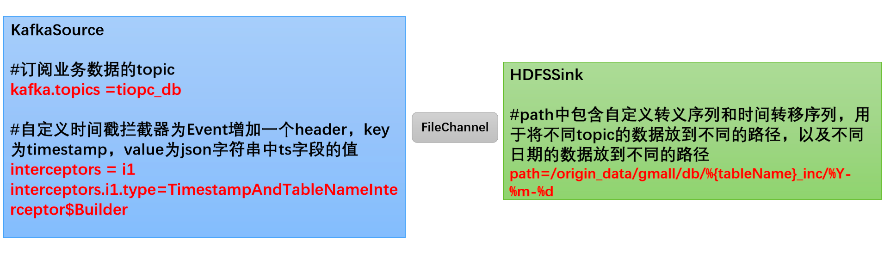

示例：

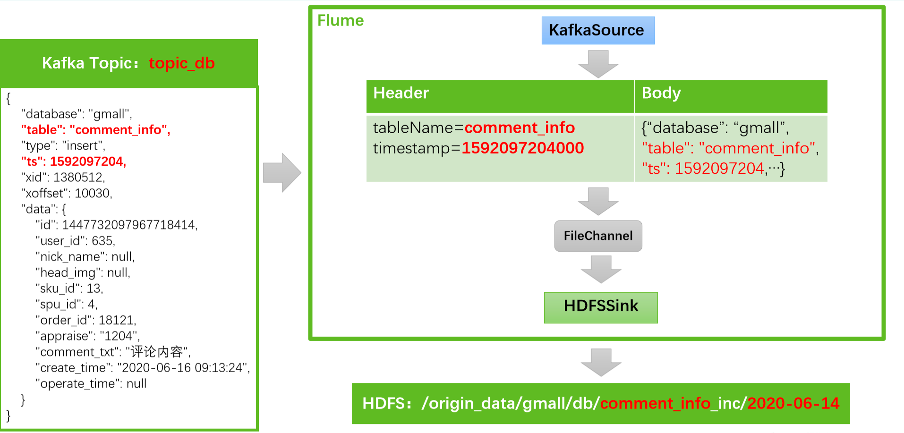

编写flume拦截器

在 package com.alex.flume.interceptor.TimestampAndTableNameInterceptor下

将代码打包成依赖包flume-interceptor-1.0-SNAPSHOT-jar-with-dependencies.jar上传到Flink03的/opt/module/flume/lib文件夹下面

#### 测试结果

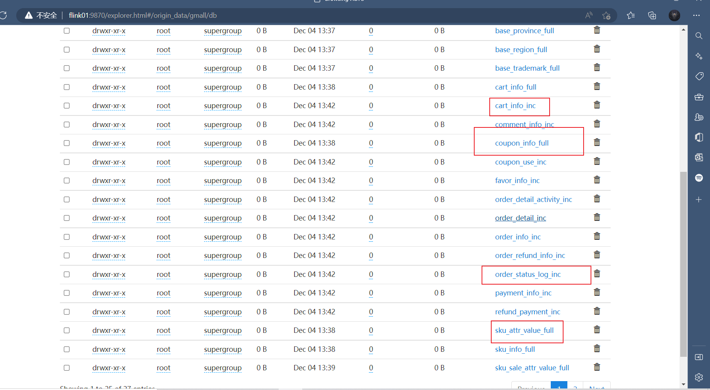

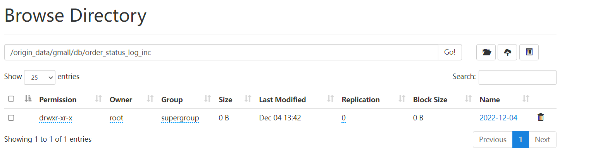

## 3 增量表首日全量同步

通常情况下，增量表需要在首日进行一次全量同步，后续每日再进行增量同步，首日全量同步可以使用Maxwell的bootstrap功能，方便起见，用

脚本mysql_to_kafka_inc_init.sh执行一次就行

为方便查看结果，提起将HDFS上之前同步的增量表数据删除

```shell
#先删除之前的测试数据
hadoop fs -ls /origin_data/gmall/db | grep _inc | awk '{print $8}' | xargs hadoop fs -rm -r -f
#重新初始化
mysql_to_kafka_inc_init.sh all
```


