[TOC]


# 开发环境搭建

## **1.Spark开发环境搭建**

这个项目离线链路采用的核心计算引擎是Spark，采用的模块为SparkSQL，采用的API为Python+SQL，即Pyspark

下面，Alex，也就是我教你们搭建一套一条龙的开发环境，对于使用Pyspark开发的朋友来说绝对舒服

***Pyspark on Yarn + 本地代码使用远程集群配置调试，写好的代码直接在Pycharm中就连接到Spark on Yarn集群提交测试，再也不用搞什么打包上传什么Spark-submit加这加那参数的，当然，开发测试完以后在集群上跑的时候，调度脚本里要加资源参数，测试时直接在Pycharm中提交，方便快捷***

### **1.1 Linux环境配置**

**前提条件，在虚拟机上安装好Hadoop和Java还有Python3，并且配置好环境变量，这三个网上很多教程，我就不过多解释了，我的Hadoop是3.0.1版本的，jdk是1.8，python是3.9**

为什么要安装python？

因为在项目中我们开发使用的是基于python的sparksql，所以需要python环境，安装完成以后使用pip 下载pyspark：pip install pyspark ==3.3.1，会连着py4j一起下了，因为java和python底层就是使用py4j基于socket进行网络通信的

前提条件完成后，然后去spark官网：https://archive.apache.org/dist/spark/ 下载对应的包

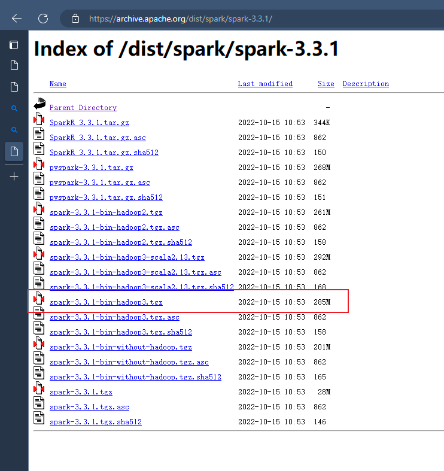

下载完成上传到虚拟机一个可靠的目录，解压，这是一款终端软件叫MobaXterm的终端目录跟随可视化功能

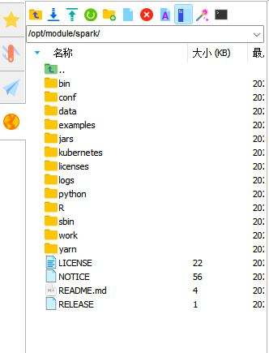

解压完成后，配置好环境变量

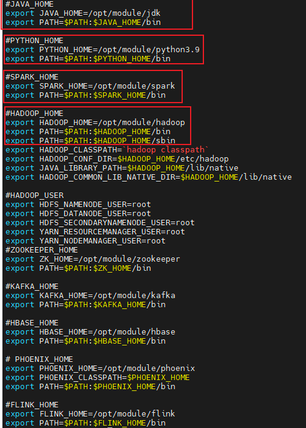

配置好环境变量以后再在spark/conf目录下添加hive-site.xml

```xml
<?xml version="1.0"?>
<?xml-stylesheet type="text/xsl" href="configuration.xsl"?>
<configuration>
    <property>
        <name>javax.jdo.option.ConnectionURL</name>
        <value>jdbc:mysql://Flink02:3306/metastore?useSSL=false&amp;useUnicode=true&amp;characterEncoding=UTF-8</value>
    </property>

    <property>
        <name>javax.jdo.option.ConnectionDriverName</name>
        <value>com.mysql.cj.jdbc.Driver</value>
    </property>

    <property>
        <name>javax.jdo.option.ConnectionUserName</name>
        <value>root</value>
    </property>

    <property>
        <name>javax.jdo.option.ConnectionPassword</name>
        <value>123456</value>
    </property>

    <property>
        <name>hive.metastore.warehouse.dir</name>
        <value>/user/hive/warehouse</value>
    </property>

    <property>
        <name>hive.metastore.schema.verification</name>
        <value>false</value>
    </property>
</configuration>
```

### **1.2 PyCharm配置**

1.打开PyCharm，点击上方工具栏的工具按钮，出现的页面里点击部署按钮，然后点击配置按钮

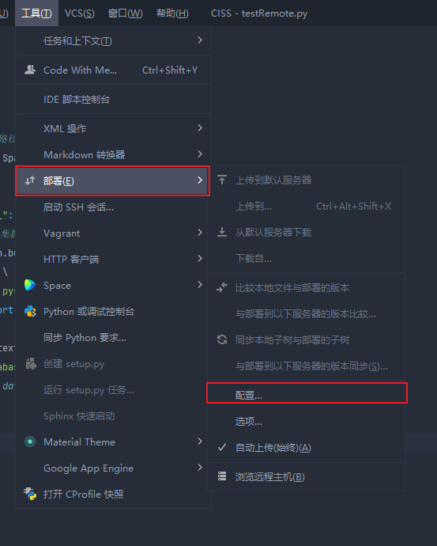

出现的新界面里先点击+按钮，选择SFTP模式

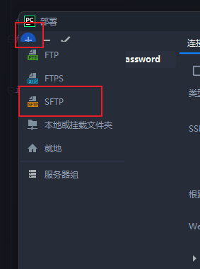

然后输出你要连接的服务器，即Spark所在的服务器(如果是集群的话就随便连一台)，前提是必须配置好跟本地主机的映射，没有配好的可以网上百度

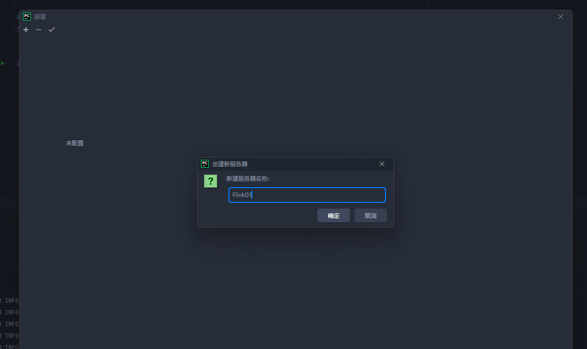

点击确定以后会让你填SSH的配置信息

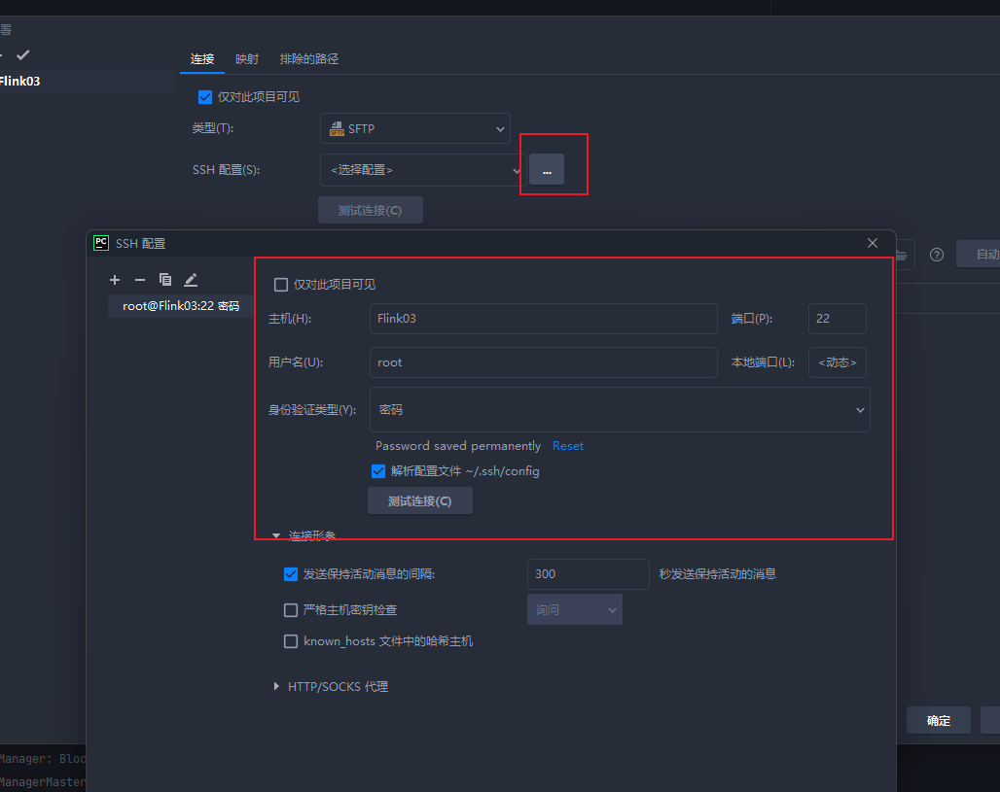

填完以后测试连接


测试连接没问题的话就点击部署界面的映射，去配置远程服务器跟本地项目的代码路径映射关系(配置好的话，IDEA会自动同步你本地的代码到集群的路径上)

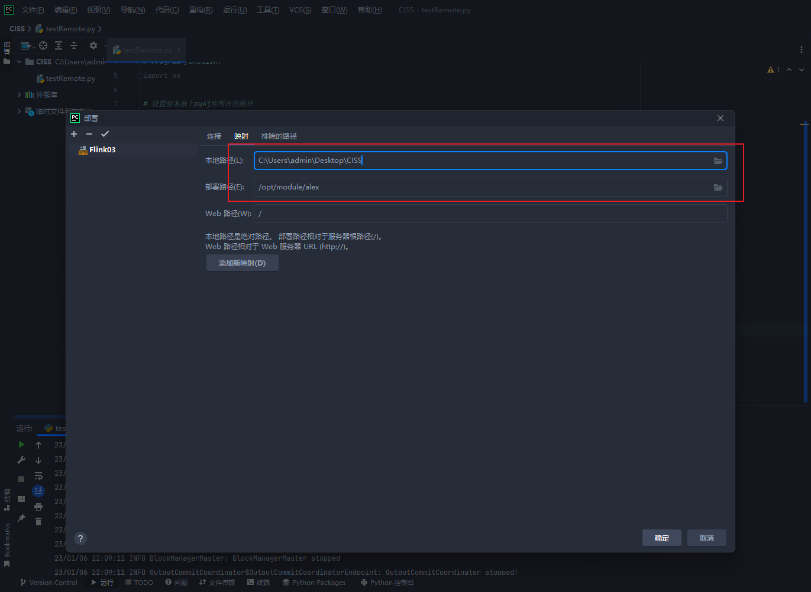

配置完映射以后Pycharm右侧会出现远程服务器的文件信息

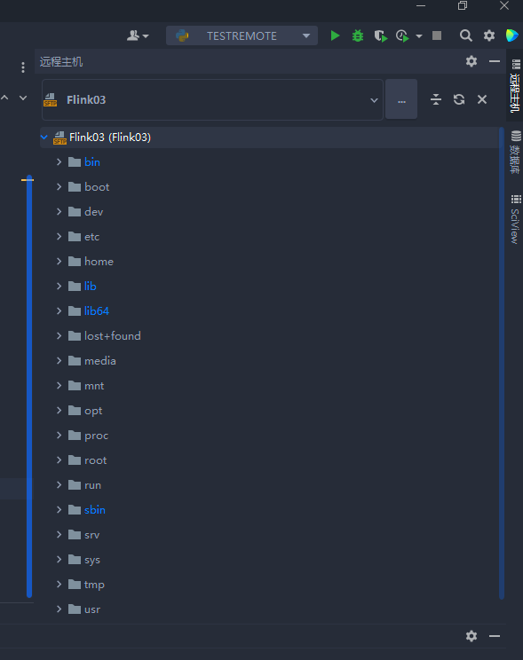

最最关键的一步来了，配置解释器，使用远程服务器上的解释器

点击 文件->设置->项目->python解释器，点击解释器的齿轮，选择添加，选择SSH解释器，然后填服务器的SSH信息，填完以后点击下一个

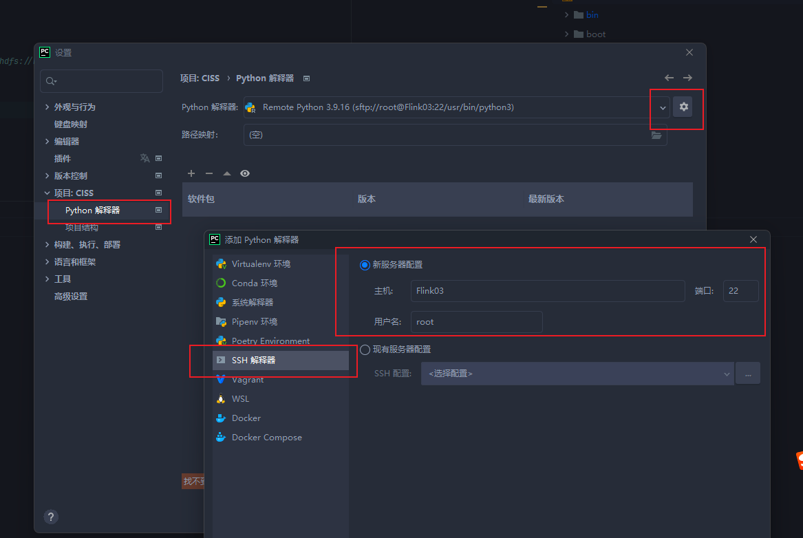

配置SSH解释器，在安装python3的时候设置了软连接，这里的解释器就选择软连接的地方，一般是/usr/bin/python3，选择完解释器以后，配置文件夹，也就是之前配置的映射，这里的文件夹最好设置跟之前的映射是同一个文件夹

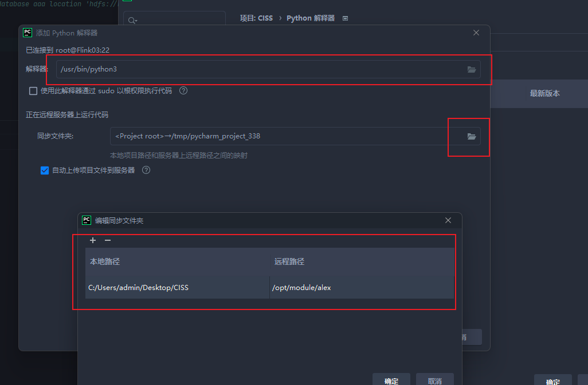

配置完以后，就可以看到远程解释器里安装的那些第三方python库，如果没看到就是没有配置好

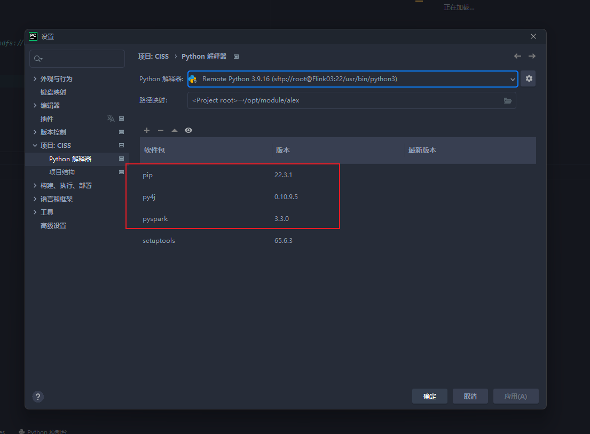

点确定以后，PyCharm会自动更新你的解释器为远程解释器，然后可以点击最上方栏的工具，选择SSH会话

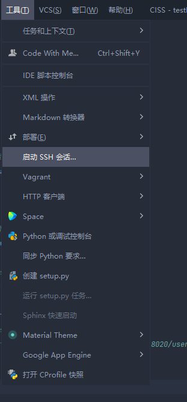

然后选择要连的主机，一般如果你是新项目第一次连，应该只有一个，我是之前测试连的，所以有两个

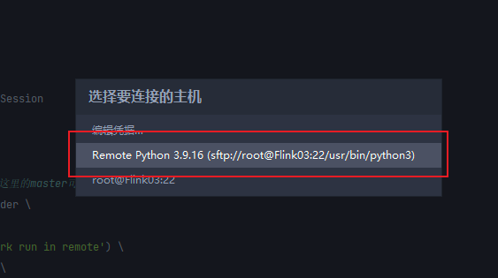

选择好后在IDEA工具底下终端界面就可以连接到远程服务器终端了

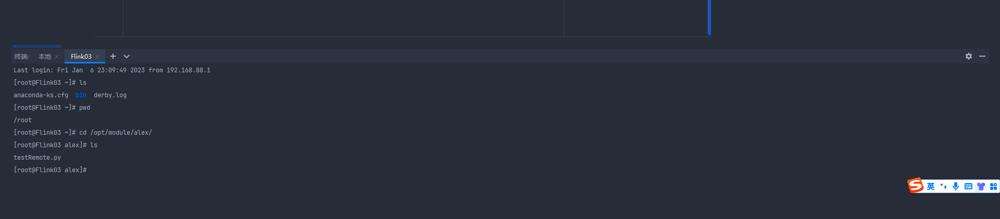

### **1.3 代码测试**

随便写一个代码

```python
if __name__ == "__main__":
    
    spark = SparkSession.builder \
    # 因为spark配置了yarn集群，这里的master可以修改为yarn
        .master('yarn') \
        .appName('Local pyspark run in remote') \
        .enableHiveSupport() \
        .getOrCreate()
    sc = spark.sparkContext.setLogLevel("INFO")
    spark.sql("show databases;").show()
    # spark.sql("create database aaa location 'hdfs://Flink01:8020/user'").show()
    spark.stop()
```

写完以后配置代码运行的参数

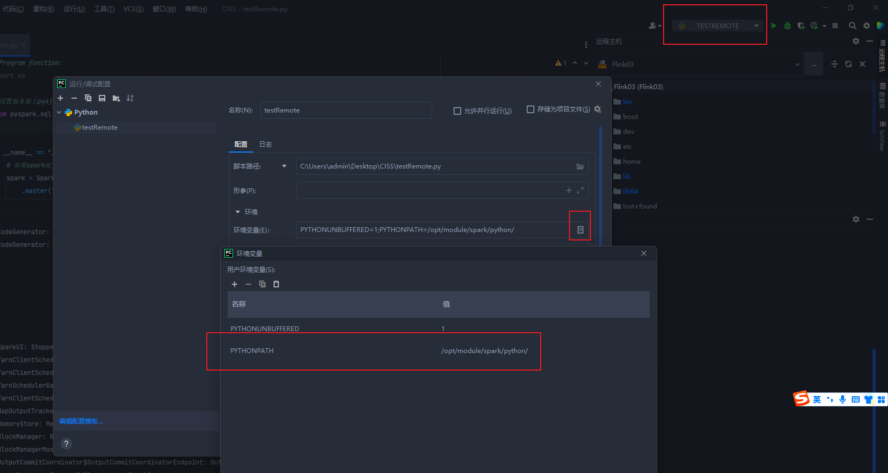

PYTHONPATH=你服务器上spark安装包下的python目录(绝对路径)

配置好以后点击运行，可以看到一些关键性的信息，说明读取到了hive的配置文件hive-site.xml里的信息

其实从第一行可以看出就是Pycharm将你的代码同步到远程服务器上面然后通过ssh命令过去在代码对应的路径下执行python代码，使用的是远程的解释器及Spark和Hadoop的环境变量，所以本地不需要安装什么spark、hadoop，元数据存在集群的MySQL里，数据存在HDFS上，计算使用Spark集群，调度使用Yarn，你就负责在本地写代码就完事了，写完测一下

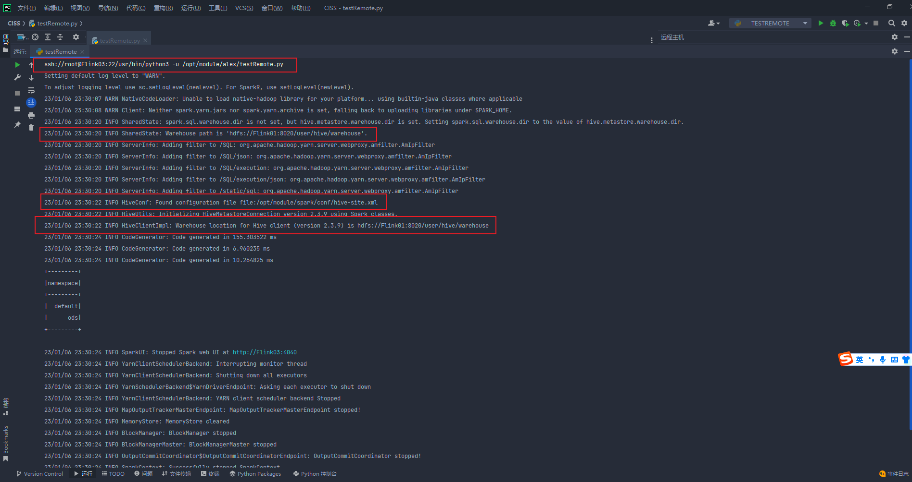

Yarn界面

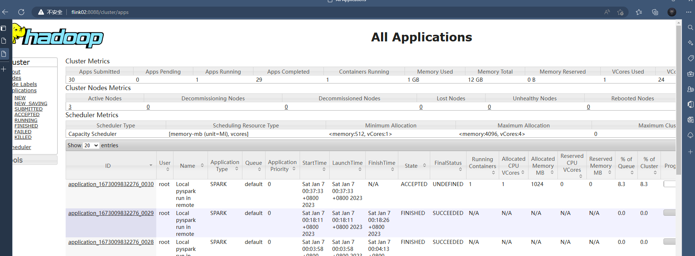

## **2.Flink开发环境搭建**