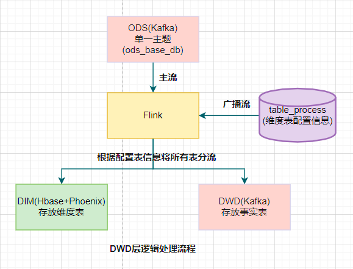
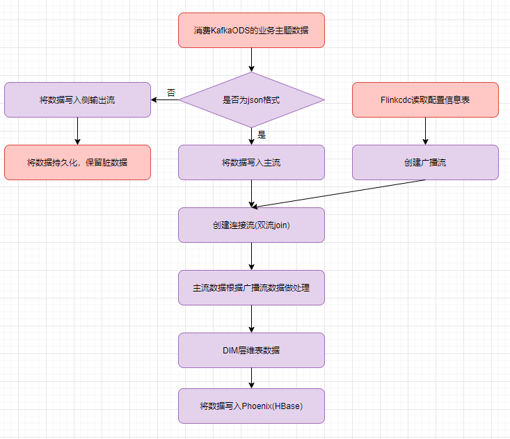
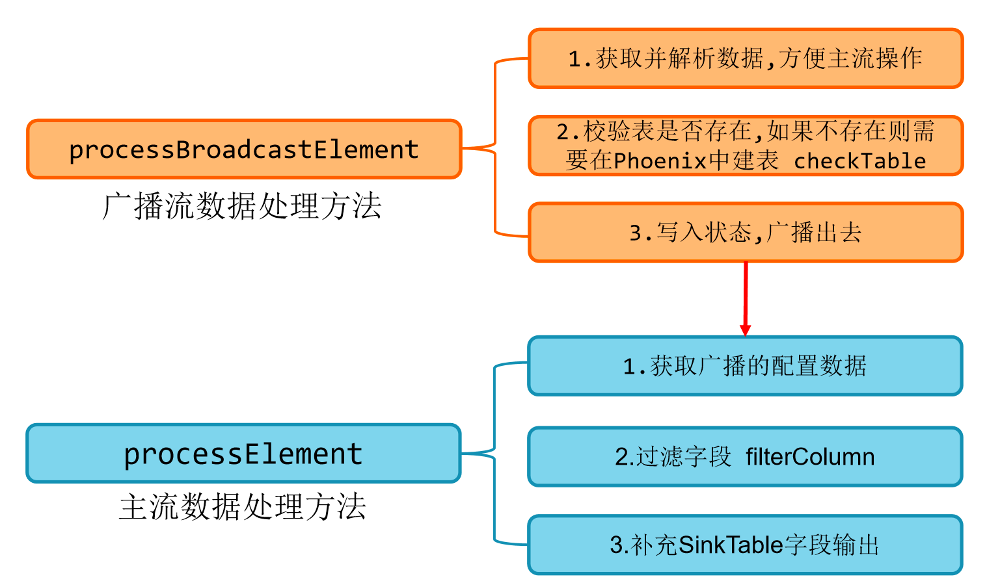
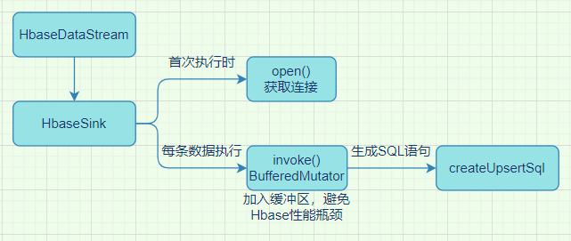
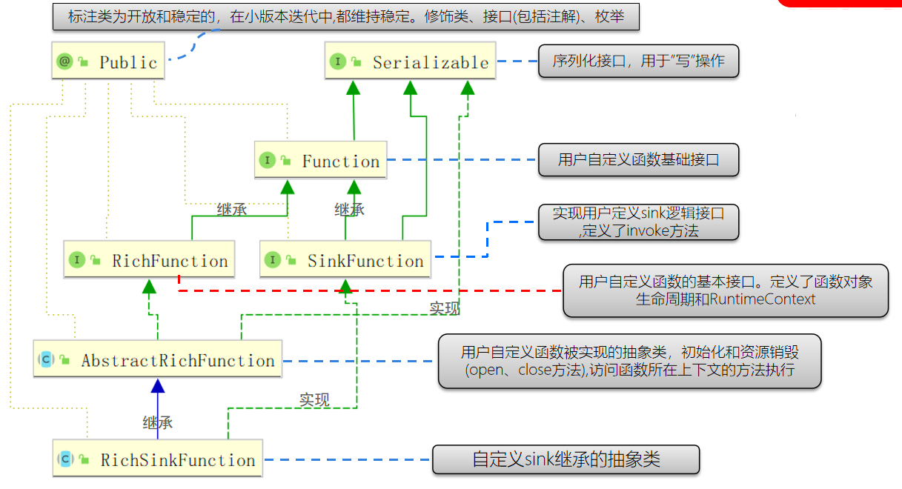
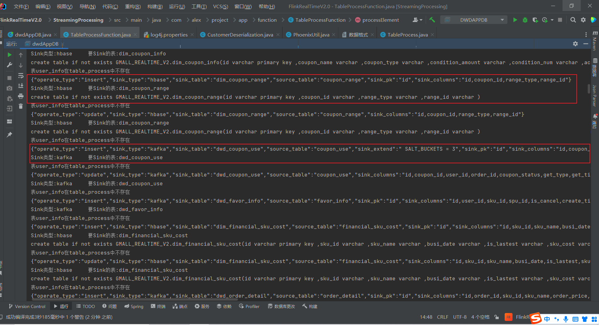
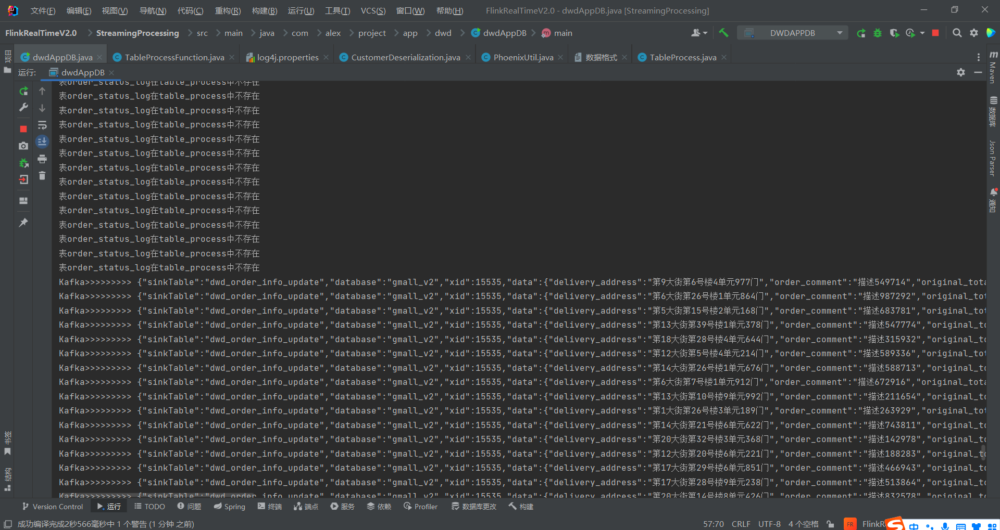

[TOC]


# 数据处理(DIM)



## 设计

DIM层设计要点：

- DIM层的设计依据是维度建模理论，该层存储维度模型的维度表。

  ```markdown
  事实表:业务过程
  		事务事实表:一行数据代表一个业务过程,且不会发生改变了
  		周期快照事实表:会发生改变,一般只关心最终的数据结果状态,比如说余额
  		累积快照事实表:一行数据代表一个不完整的业务过程,会发生改变,且改变的内容是有限个
  	维度表:描述度量值得角度数据
  ```

- DIM层的数据存储在 HBase 表中
  - DIM 层表是用于维度关联的，要通过主键去获取相关维度信息，这种场景下 K-V 类型数据库的效率较高。常见的 K-V 类型数据库有 Redis、HBase，而 Redis 的数据常驻内存，会给内存造成较大压力，因而选用 HBase 存储维度数据。

- DIM层表名的命名规范为DIM_表名

## 数据源

### 用户行为日志数据

我们前面采集的日志数据已经保存到 Kafka 中，作为日志数据的 ODS 层，从 Kafka 的ODS 层读取的日志数据分为 3 类, 页面日志、启动日志和曝光日志。这三类数据虽然都是用户行为数据，但是有着完全不一样的数据结构，所以要拆分处理。将拆分后的不同的日志写回 Kafka 不同主题中，作为日志 DWD 层。**页面日志输出到主流,启动日志输出到启动侧输出流,曝光日志输出到曝光侧输出流**

#### 主要任务

##### 识别新老用户

- 本身客户端业务有新老用户的标识，但是不够准确，需要用实时计算再次**确认(不涉及业务操作，只是单纯的做个状态确认)**
- 保存每个 mid 的首次访问日期，每条进入该算子的访问记录，都会把 mid 对应的首次访问时间读取出来，只有首次访问时间不为空，则认为该访客是老访客，否则是新访客。同时如果是新访客且没有访问记录的话，会写入首次访问时间。

##### 利用侧输出流实现数据拆分

- 根据日志数据内容,将日志数据分为 3 类, 页面日志、启动日志和曝光日志。页面日志输出到主流,启动日志输出到启动侧输出流,曝光日志输出到曝光日志侧输出流

##### 将不同流的数据推送下游的 Kafka 的不同 Topic 中

### 业务数据

业务原始数据前面已经通过模拟器将数据推送到kafka的主题里，业务数据的变化，我们可以通过 FlinkCDC 采集到，但是 FlinkCDC 是把全部数据统一写入一个 Topic 中, 这些数据包括事实数据，也包含维度数据，这样显然不利于日后的数据处理，所以这个功能是从 Kafka 的业务数据 ODS 层读取数据，经过处理后，将维度数据保存到HBase，将事实数据写回 Kafka 作为业务数据的 DWD 层。那么如何让程序知道流中的哪些数据是维度数据？维度数据又应该写到 HBase 的哪些表中？为了解决这个问题，我选择在 MySQL 中构建一张配置表，通过 Flink CDC 将配置表信息读取到程序中。

#### 配置表设计

**字段解析**

我们将为配置表设计五个字段

- source_table：作为数据源的业务数据表名 

- sink_table：作为数据目的地的 Phoenix 表名

- sink_columns：Phoenix 表字段

- sink_pk：Phoenix 表主键

- sink_extend：Phoenix 建表扩展，即建表时一些额外的配置语句

将 source_table 作为配置表的主键，可以通过它获取唯一的目标表名、字段、主键和建表扩展，从而得到完整的 Phoenix 建表语句。

**在MySQL中创建对应的解析表并开启binlog**

```sql
create database gmall_config charset utf8 default collate utf8_general_ci;
CREATE TABLE `table_process` (
  `source_table` varchar(200) NOT NULL COMMENT '来源表',
  `sink_table` varchar(200) DEFAULT NULL COMMENT '输出表',
  `sink_columns` varchar(2000) DEFAULT NULL COMMENT '输出字段',
  `sink_pk` varchar(200) DEFAULT NULL COMMENT '主键字段',
  `sink_extend` varchar(200) DEFAULT NULL COMMENT '建表扩展',
  PRIMARY KEY (`source_table`)
) ENGINE=InnoDB DEFAULT CHARSET=utf8;
在MySQL配置文件my.cfg中增加gmall_config的开启binlog步骤
```

配置表建表及数据导入可以参考table_process初始化配置.sql文件

#### 主要任务

##### 接收Kafka数据，过滤空值数据

对Maxwell抓取的数据进行ETL，有用的部分保留，没用的过滤掉，在Maxwell没有做过滤操作是方便以后增加维表。

##### 动态分流将所有业务表拆分成维度表和事实表

由于Maxwell是把全部数据统一写入一个Topic中, 这样显然不利于日后的数据处理。所以需要把各个维度表拆开处理。在实时计算中一般把维度数据写入存储容器，一般是方便通过主键查询的数据库比如HBase,Redis,MySQL等。这样的配置不适合写在配置文件中，因为这样的话，业务端随着需求变化每增加一张维度表表，就要修改配置重启计算程序。所以这里需要一种动态配置方案，把这种配置长期保存起来，一旦配置有变化，实时计算可以自动感知。这种可以有2个方案实现：

- 一种是用Zookeeper存储，通过Watch感知数据变化
- 另一种是用mysql数据库存储
  - 这一种有两个解决方案：

​					(1) 定时任务:每隔一段时间加载一次配置信息，将定时任务写在Open方法

​                    (2) 监控配置信息:一旦配置信息增加了数据,可以立马获取到

定时任务会存在数据丢失的问题，所以选用的是监控配置信息这种方案。这种方案又有两种可行方式：

​	(1) FlinkCDC直接监控MySQL配置信息表binlog创建配置流，将配置流作为广播流与主流进行连接

​	(2) 通过flume的 Taildir Source读取到Kafka，再通过flink消费创建流，这样的话，流比较长

这里采用的是第二种方式。



**配置信息数据流处理成广播流并写入状态，通过广播状态，主流可以从状态里读取数据**

注：在配置信息量不大的时候这么做可以，如果未来配置信息量增大了，这种方式因为需要在每个并行度里广播状态，会产生很多冗余，这个时候可以按照表名进行keyby，这种方法有可能会造成数据倾斜



##### 把分好的流保存到对应存储介质中

- 业务数据保存到 Kafka 的主题中
- 维度数据保存到 HBase 的表中



HbaseSink 继承了 RickSinkFunction，这个 function 得分两条时间线

- 一条是任务启动时执行 open 操作（图中紫线），我们可以把连接的初始化工作放在此处一次性执行。

- 另一条是随着每条数据的到达反复执行 invoke()（图中黑线）,在这里面我们要实现数据的保存，主要策略就是根据数据组合成 sql 提交给 hbase。

**RichSinkFunction组成:**



动态分流测试结果：



上图可以看到有一些表在业务数据中发生了变化，但是在table_process中不存在这样的表，所以会抛"表xxxx在table_process中不存在"这样的日志，因为在设计的时候，业务数据库总共46张表，加上table_process一共47张，其中16张维度表，31张事实表，维度表的变化及表信息会记录在table_process中，在dwd层的时候将配置信息封装成配置流跟主流进行处理，将主流里的维度数据写入Hbase，事实表数据写入Kafka


